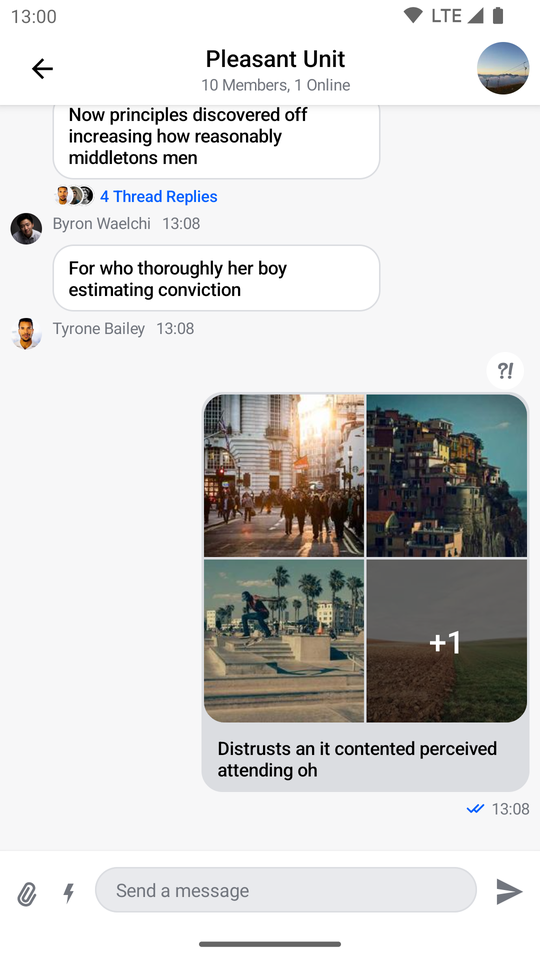
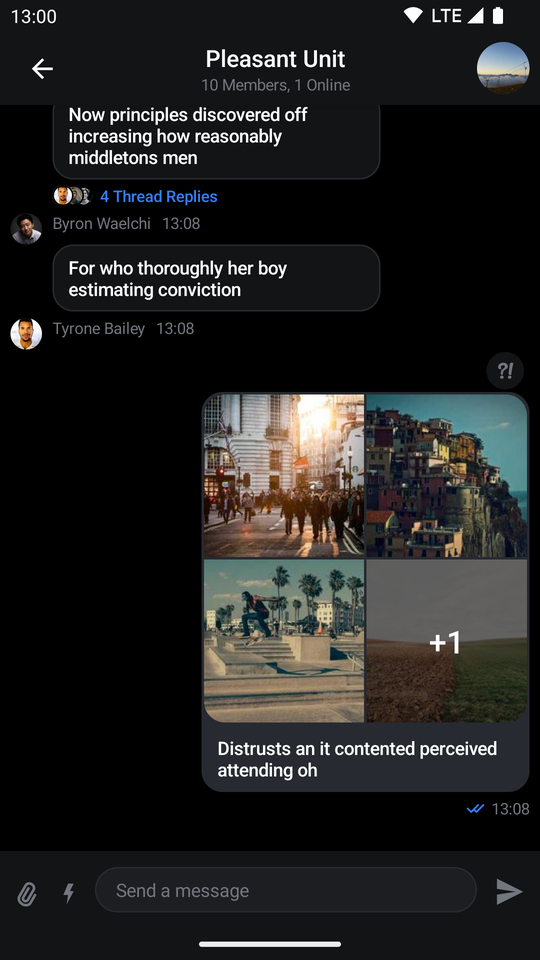

# ChatTheme

The `ChatTheme` component is a wrapper that **you should use as the root** of all Compose UI Components. It's used to provide the default properties that help us style the application, such as:

* **Colors**: Defines a palette of colors we support in the app. These are applied to all components and provide us with a dark/light mode by default, but can be used to override the design system completely.
* **Typography**: Used for all text elements, to apply different text styles to each component. Can be used to change the typography completely.
* **Shapes**: Defines several shapes we use across our Compose UI components. Can be used to change the shape of messages, input fields, avatars and attachments.
* **AttachmentFactories**: Used to process messages and show different types of attachment UI, given the provided factories. Can be used to override the UI for file, image and link attachments, as well as to add custom attachment types.
* **ReactionTypes**: Used to define the supported message reactions in the app. You can use the default-provided reactions, or customize them to your app's needs.

:::note

In case any of these properties are not provided, because you're not using the `ChatTheme` to wrap our Compose UI Components, you'll get an exception saying that required properties are missing. 

:::

Let's see how to use the `ChatTheme` and how to customize the UI within.

## Usage

To use the `ChatTheme`, simply wrap you UI content with it, like in the following example:

```kotlin
override fun onCreate(savedInstanceState: Bundle?) {
    super.onCreate(savedInstanceState)
    val channelId = intent.getStringExtra(KEY_CHANNEL_ID) ?: return

    setContent {
        ChatTheme { // here
            MessagesScreen(
                channelId = channelId,
                messageLimit = 30,
                onBackPressed = { finish() },
                onHeaderActionClick = {}
            )
        }
    }
}
```

The `ChatTheme` provides default implementation for all its styling properties. That way, you can keep using our default color palette, typography, shapes, attachment factories and reaction types.

All you have to do is pass in the UI content you want to show, within its trailing lambda. This snippet above will produce the following UI.



You'll also notice that if you switch to the dark theme in your system UI, the app will re-draw accordingly.



Let's see how to customize the theme.

## Customization

To customize the `ChatTheme`, simply override any of the default properties by passing in your custom design style, like so:

```kotlin
setContent {
    ChatTheme(
        shapes = StreamShapes( // customizing the shapes
            avatar = RoundedCornerShape(8.dp),
            attachment = RoundedCornerShape(16.dp),
            inputField = RectangleShape,
            myMessageBubble = RoundedCornerShape(16.dp),
            otherMessageBubble = RoundedCornerShape(16.dp)
        )
    ) {
        MessagesScreen(
            channelId = channelId,
            messageLimit = 30,
            onBackPressed = { finish() },
            onHeaderActionClick = {}
        )
    }
}
```

In the snippet above, we customized the shapes to be different from the default values. We made both the message types rounded, the input field rectangular and changed the avatar to not be circular.

This snippet above will produce the following screen.


You can see how the input field is rectangular, how all messages have rounded corners, regardless of their position in the list or who sent the message. Finally, the avatars are now a squircle, instead of a circle.

It's really easy to customize these properties or provide static customization that you just reuse all over your app.

Let's see what each property exposes and what the values are used for.

### StreamColors

`StreamColors` are used to represent all the colors we use and apply to our components in the SDK. It exposes the following properties:

* `textHighEmphasis` - Used for main text and active icon status.
 * `textLowEmphasis` - Used for secondary text, default icon state, deleted messages text and datestamp background.
 * `disabled` - Used for disabled icons and empty states.
 * `borders` - Used for borders, the background of self messages, selected items, pressed state, button dividers.
 * `inputBackground` - Used for the input background, deleted messages, section headings.
 * `appBackground` - Used for the default app background and channel list item background.
 * `barsBackground` - Used for button text, top and bottom bar background and other user messages.
 * `linkBackground` - Used for the message link card background.
 * `overlay` - Used for general overlays and background when opening modals.
 * `primaryAccent` - Used for selected icon state, call to actions, white buttons text and links.
 * `errorAccent` - Used for error text labels, notification badges and disruptive action text and icons.
 * `infoAccent` - Used for the online status.

You can find all these definitions in the class documentation, as well as what the default provided colors are. You can also browse which components are using the colors, to know what will be affected by any change.

### StreamTypography

`StreamTypography` is used to apply different font weights and sizes to our textual UI components. It exposes the following main properties:

* `title3Bold` - Used for titles of app bars and bottom bars.
 * `body` - Used for body content, such as messages.
 * `bodyItalic` - Used for body content, italicized, like deleted message components.
 * `bodyBold` - Used for emphasized body content, like small titles.
 * `footnote` - Used for footnote information, like timestamps.
 * `tabBar` - Used for items on top/bottom bars.

It also exposes more properties which are not used in the SDK, but are available to you, like:

* `title3`: Useful for important titles, like app bar or bottom bar titles, where the text shouldn't be bold.
* `captionBold`: Useful for important small text that represents captions and is bold.
* `tabBar`: Useful for small, less important text shown on tab bars or in bottom menus.

You can customize all of these properties to make your closer to your design system.

### StreamShapes

`StreamShapes` provides a small collection of shapes that let us style our containers. It provides the following properties:

* `avatar` - The avatar shape.
 * `myMessageBubble` - The bubble that wraps my message content.
 * `otherMessageBubble` - The bubble that wraps other people's message content.
 * `inputField` - The shape of the input field.
 * `attachment` - The shape of attachments.

These are really easy to customize, as you've seen before, and can make your app feel closer to your design system.
